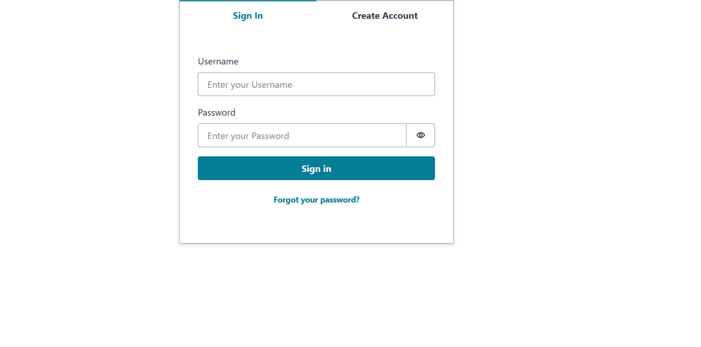
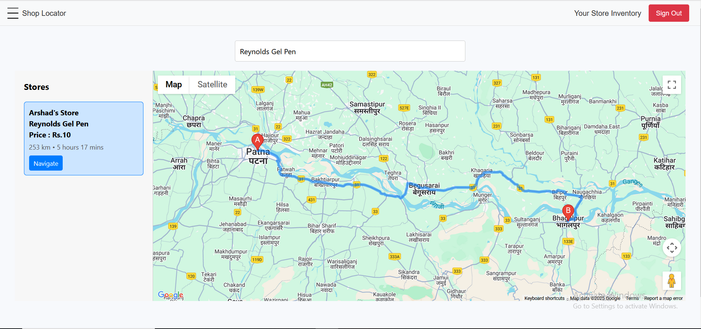
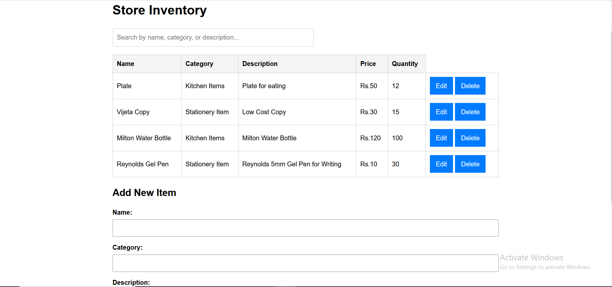

# 🛍️ Store Locator & Inventory App

A full-stack web application where **store owners** can register their stores on a map, add items to their inventory, and **customers** can search for items and find the **stores** that have them in stock.

---

## 🚀 Live Demo

👉 [Live Demo Link](#) *https://d1duijh0xq1z2z.cloudfront.net*

---

## 📸 Screenshots
### Login Page

### Search Page

### Inventory Management

---

## ✨ Features

### 🛒 For Store Owners
- Register/login securely
- Add your store location
- Add, update, and delete inventory items

### 🔍 For Customers
- Search for specific items
- Find nearest stores with the item in stock
- View distance from current location to each store
- Navigate to the store location
---

## 🧰 Tech Stack

- **Frontend:** React, AWS Amplify
- **Backend:** Java (AWS Lambda)
- **Authentication:** AWS Cognito
- **Database:** DynamoDB
- **Map & Geolocation:** Google Maps API
- **Hosting:** AWS S3 (frontend), API Gateway (backend)

---